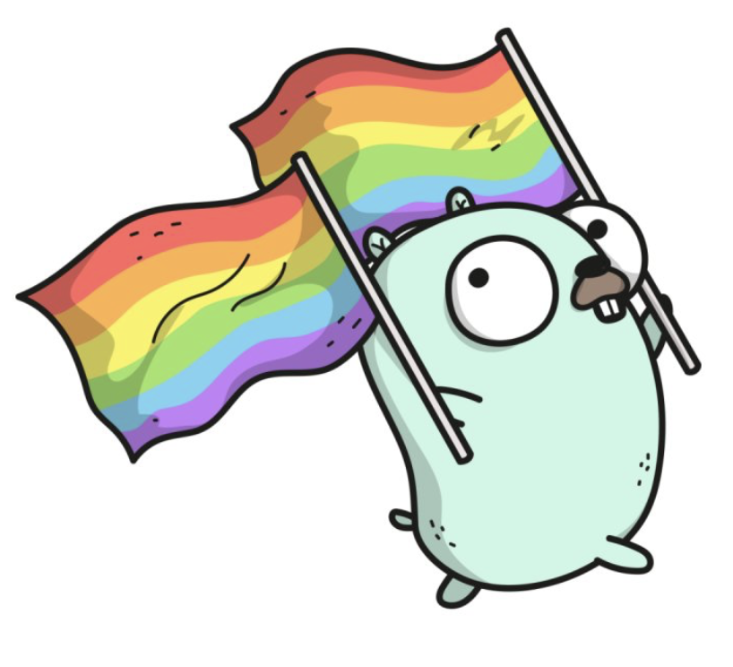

<h1>RESTful web service using gorilla mux, gorm, and postgresql</h1>

This repository is an example on how to create RESTful web service using gorrila mux, gorm, and postgresql.

<h3>Prerequisites</h3>

1. <a href="https://golang.org">Go</a>

2. <a href="http://www.gorillatoolkit.org/pkg/mux">Gorilla Mux</a>

3. <a href="http://gorm.io">GORM</a>

4. <a href="https://www.postgresql.org">PostgreSQL</a>

